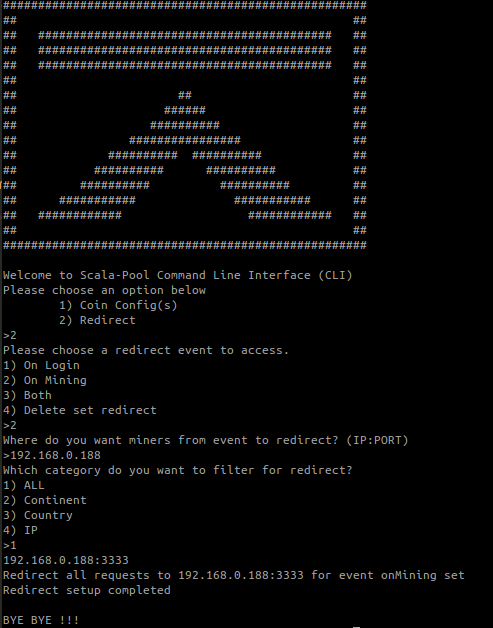

# Command Line Interface

To see all avaliable commands run the cli by executing
```bash
node cli.js
```

## config
Setup and validate your config.json


## redirect
Setup redirect action for miners



